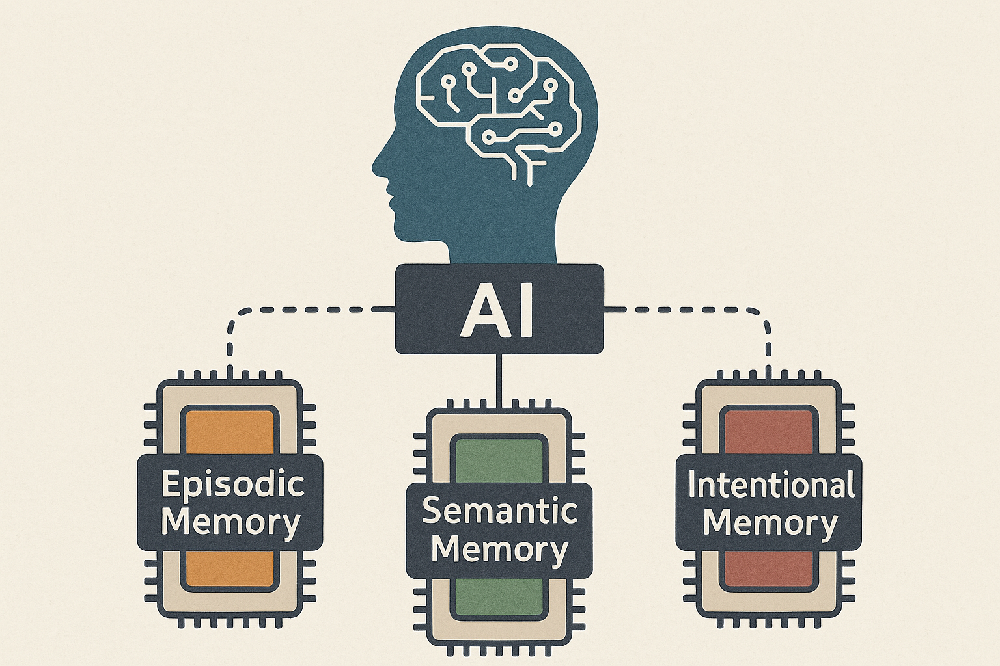

# theRiverLethe
AI models with adaptive memory management and strategic forgetting, inspired by Greek mythology and neuroscience.

## Academic History of Titans Architecture
- **Background**: Prior to Titans Architecture, significant research was conducted related to test-time model adaptation and fast-weighted methods, primarily building on two key concepts:
  > Self-supervised Learning and Meta Learning formed the foundation for these approaches.
- **2017-03-09** [Model-Agnostic Meta-Learning (MAML)](https://arxiv.org/abs/1703.03400): Pioneered fast adaptation to new tasks with minimal training examples, establishing core principles for adaptive models.
- **2019-09-29** [Test-time Training](https://arxiv.org/abs/1909.13231): Advanced the field by introducing methods for model adaptation during inference time without requiring complete retraining.
- **2024-07-05** [TTT-Linear/MLP](https://arxiv.org/abs/2407.04620): Introduced as a Self-Attention alternative for Transformers, enabling automatic retention of input sequences by using Self-supervised learning.
- **2024-12-31** [Titans Architecture](https://arxiv.org/abs/2501.00663): Established a novel memory-based architecture combining Transformer's short-term memory capabilities (Self-Attention) with MLP-based long-term memory, significantly improving performance on extended sequential tasks.
- **2025-MM-DD** [Atlas Model]()

## Overview
### Titans Origin
- Titans introduced a new architecture family which consisted of:
  - Core Self-Attention (Short-term Memory, In-context learning)
  - Contextual Memory (Long-term Memory)
  - Persistent Memory (Fixed Memory)

#### Memory as a Context (MAC)

#### Memory as a Gate (MAG)

#### Memory as a Layer (MAL)

### Atlas Model
- Atlas is a Titan in Greek mythology who is assigned the role of supporting the celestial sphere.

- Atlas Model proposes a combination of cognitive-scientific memory components.
  - Semantic Memory (Retrospective, Long-term Memory)
  - Episodic Memory (Retrospective, Long-term Memory)
  - Intentional Memory (Prospective, Long-term Memory)
  - Active Cognitive State (Working/Operational, Short-term Memory)

